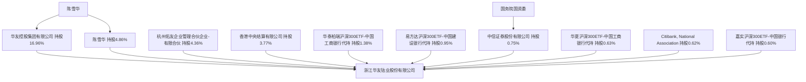

## KChina-AI

### Embadding 模型（多语言支持）

https://huggingface.co/models?other=text-embeddings-inference

| 模型                         | 说明                 |     |     |
| -------------------------- | ------------------ | --- | --- |
| Qwen3-Embedding-0.6B       | Qwen官方已有Ascend优化   |     |     |
| BAAI/bge-m3                | 已有MindSpore/ONNX版本 |     |     |
| google/embeddinggemma-300m | google 新开源轻量模型     |     |     |

### 图片视频模型

[Open VLM Leaderboard - a Hugging Face Space by opencompass](https://huggingface.co/spaces/opencompass/open_vlm_leaderboard)

- LLaVA-NeXT 

- Qwen3-VL （30b/235B）

### ASR 语音模型

https://huggingface.co/spaces/hf-audio/open_asr_leaderboard

- openai/whisper-large-v3-turbo 809M

- openai/whisper-large-v3 1550 M

- DataoceanAI/dolphin-small 372 M 
  
  - 清华团队，主要针对东亚/南亚/中文方言适配

| 地区（按国别或境内/境外） | 营收金额 | 营收变动率 | 毛利率 |
| ------------- | ---- | ----- | --- |
|               |      |       |     |
|               |      |       |     |

## 知识库

主营业务分销售模式情况

~~dataset_id： "c67e8841-b317-4c9d-8bad-d3762960477c"~~

dataset_id: "b9a78298-0794-4872-aa3b-e3b9dbe700e6"

"dataset_name": "kchina-ai-2-4000token"

"document_id": "0fadcc49-5ed2-4572-a300-ff2a1d86b81e",

"document_name": "01_Qichacha report_浙江华友钴业股份有限公司-企业信用报告专业版-20250522164108.pdf",

api_base_url: http://docker-api-1:5001/v1

api_secret: dataset-O8dRu9zMWI8MLuq7svFpy5j7

