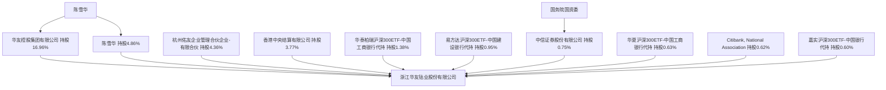

## KChina-AI

### Embadding 模型（多语言支持）

https://huggingface.co/models?other=text-embeddings-inference

| 模型                         | 说明                 |     |     |
| -------------------------- | ------------------ | --- | --- |
| Qwen3-Embedding-0.6B       | Qwen官方已有Ascend优化   |     |     |
| BAAI/bge-m3                | 已有MindSpore/ONNX版本 |     |     |
| google/embeddinggemma-300m | google 新开源轻量模型     |     |     |

### 图片视频模型

[Open VLM Leaderboard - a Hugging Face Space by opencompass](https://huggingface.co/spaces/opencompass/open_vlm_leaderboard)

- LLaVA-NeXT 

- Qwen3-VL （30b/235B）

### ASR 语音模型

https://huggingface.co/spaces/hf-audio/open_asr_leaderboard

- openai/whisper-large-v3-turbo 809M

- openai/whisper-large-v3 1550 M

- DataoceanAI/dolphin-small 372 M 
  
  - 清华团队，主要针对东亚/南亚/中文方言适配

| 地区（按国别或境内/境外） | 营收金额 | 营收变动率 | 毛利率 |
| ------------- | ---- | ----- | --- |
|               |      |       |     |
|               |      |       |     |

## 知识库

主营业务分销售模式情况

~~dataset_id： "c67e8841-b317-4c9d-8bad-d3762960477c"~~

dataset_id: "b9a78298-0794-4872-aa3b-e3b9dbe700e6"

"dataset_name": "kchina-ai-2-4000token"

"document_id": "0fadcc49-5ed2-4572-a300-ff2a1d86b81e",

"document_name": "01_Qichacha report_浙江华友钴业股份有限公司-企业信用报告专业版-20250522164108.pdf",

api_base_url: http://docker-api-1:5001/v1

api_secret: dataset-O8dRu9zMWI8MLuq7svFpy5j7



## AI 2026

### llm 资源

```
// kchina 阿里云
https://dashscope.aliyuncs.com/compatible-mode/v1
sk-f1c704cca6314172888436ef81eb5174
// claude 
export ANTHROPIC_BASE_URL="https://dashscope.aliyuncs.com/apps/anthropic"
export ANTHROPIC_AUTH_TOKEN="sk-f1c704cca6314172888436ef81eb5174"
export ANTHROPIC_MODEL="qwen3-coder-plus"
```

### RPA （Robotic Process Automation）

知识库版本控制，多个来源优先级（系统提取，手工录入）更新
客户资料多知识库管理 权限控制 
2 次 maker表单 查询以及填充

#### 计划

- 这周四 14/05 
  技术分析，可行性

- 下2周 28/05
  
  - 知识库原型（html） 
    - 客户知识库页面
      - 文件管理 - 文件列表 下载
        - 资料库管理 -各字段单页管理
          - 更新资料（创建任务）
          - 任务管理 - 任务状态列表
        
        （客户列表 -> 信息列表， 来源列表合并，不需要客户管理- API获取，在资料库上传文件创建任务）
    - 知识库管理页面（字段-来源-更新修改等）
  - page- content 表格自动填写 录屏

### AI Assistant

### Binkor Enhance - RAG file/PPT gen

### POC Hermes Agent

模型 qwen3.6-27
图片 o-chart 

| 场景                     | 是否支持 | 备注                                                     |
| ---------------------- | ---- | ------------------------------------------------------ |
| 图片o-chart 提取           | 支持   |                                                        |
| work文档 下 o- chart 内容提取 | 支持   |                                                        |
| Pdf 大文档内容提取            | 支持   |                                                        |
| .m4a 音频文件提取            | 不支持  | 显示0字节（空文件）异常， 大模型也不支持音频文件分析                            |
| Mp4 视频内容提取             | 支持   | 只支持拆分帧率逐帧发送图片到大模型逐帧分析，不支持完整视频文件发送整体分析（大模型本身是支持视频直接分析的） |
| pdf 带ocr图片             | 支持   | 会提取图片发送大模型分析后生成结果                                      |

支持/v1/chat/completions open ai 接口，但是只支持上传图片文件，其他文件不支持上传

### 数据源需求
```
裁判文书网https://wenshu.court.gov.cn/：不需要登录                             该客户搜索出来的裁判文书
上交所https://www.sse.com.cn/：不需要登录                                        年报（一定有），募集说明书（若有），评级报告（若有）
深交所https://www.szse.cn/index/index.html：不需要登录                     年报（一定有），募集说明书（若有），评级报告（若有）
港交所http://www.hkex.com.hk/?sc_lang=zh-HK：不需要登录                 年报（一定有），
也研究一下抓这些网站是否法律合规允许，或者该网站协议是否有披露禁止机器人抓取之类，会不会给我们行带来负面
```
#### 实用命令

``````
hermes sessions list
hermes chat --resume 20260514_155016_2e0eb1
``````

